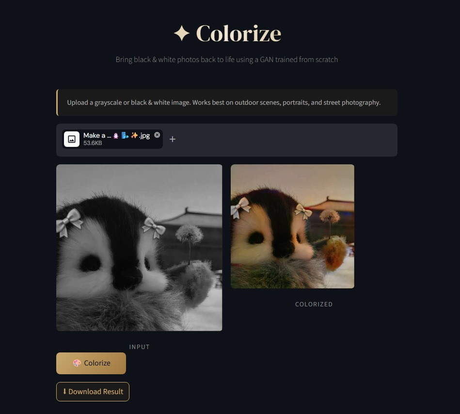

# ✦ Colorize - AI-Powered Image Colorization

Bring black & white photos back to life using a **Generative Adversarial Network (GAN)** trained from scratch. This web application uses a ResNet18-based UNet architecture with a PatchGAN discriminator to intelligently colorize grayscale and black & white images.

## The App is live @ https://ugh-colorizer.streamlit.app/




## 🎨 Features

- **High-Quality Colorization**: Intelligently colorizes grayscale images using a trained GAN model
- **User-Friendly Web Interface**: Clean, modern UI built with Streamlit
- **Fast Processing**: GPU-optimized inference with CUDA support
- **Multiple Format Support**: Works with JPG, JPEG, and PNG images
- **One-Click Download**: Easily download colorized results as PNG files
- **Optimized for Real-World Scenes**: Works best on outdoor scenes, portraits, and street photography

## 🛠️ Tech Stack

- **Framework**: PyTorch
- **Generator Architecture**: ResNet18-based UNet
- **Discriminator**: PatchGAN (3-layer convolutional discriminator)
- **Image Processing**: scikit-image, Pillow, NumPy
- **Web UI**: Streamlit
- **Color Space**: LAB (converts RGB ↔ LAB for better color learning)

## 📋 Requirements

- Python 3.8+
- CUDA-capable GPU (recommended for faster inference)
- 2GB+ RAM

## 🚀 Installation

### 1. Clone the Repository
```bash
git clone https://github.com/yourusername/colorize.git
cd colorize
```

### 2. Install Dependencies
```bash
pip install -r requirements.txt
```

### 3. Download the Pre-trained Model
Ensure you have `final_model.pt` in the project root directory. This file contains the trained GAN weights.

```
colorize/
├── app.py
├── final_model.pt
├── requirements.txt
└── README.md
```

## ▶️ Usage

### Run the Web Application
```bash
streamlit run app.py
```

The application will open in your default browser at `http://localhost:8501`

### How to Use
1. **Upload** a grayscale or black & white image (JPG, JPEG, or PNG)
2. **Click** the "🎨 Colorize" button
3. **View** the colorized result side-by-side with the original
4. **Download** the colorized image as PNG

## 🧠 Model Architecture

### Generator (net_G)
- **Backbone**: ResNet18 with modified input layer (accepts 1-channel L channel)
- **Architecture**: Dynamic UNet with skip connections
- **Output**: 2-channel ab values in LAB color space
- **Input Size**: 256×256 pixels
- **Activation**: Tanh for output normalization

### Discriminator (net_D)
- **Type**: PatchGAN (discriminates 70×70 overlapping patches)
- **Layers**: 3 convolutional layers with batch normalization
- **Purpose**: Ensures locally coherent colorization
- **Input Channels**: 3 (concatenated L + ab)

### Training Details
- **Loss Functions**: 
  - GAN Loss (Binary Cross-Entropy with Logits)
  - L1 Loss (100× weight for perceptual accuracy)
- **Optimizer**: Adam (β₁=0.5, β₂=0.999)
- **Learning Rate**: 2e-4 for both G and D
- **Color Space**: RGB → LAB (luminance separate from color)

## 🎯 How It Works

1. **Preprocessing**: Convert input image to LAB color space, extract L (luminance) channel
2. **Normalization**: Normalize L channel to [-1, 1] range
3. **Generation**: ResNet18-UNet predicts ab (color) channels from L channel
4. **Reconstruction**: Combine predicted ab with original L to reconstruct RGB image
5. **Post-processing**: Clip values to valid range and convert to uint8

## 📊 Performance

- **Inference Time**: ~2-5 seconds on GPU (varies by hardware)
- **Model Size**: ~54MB
- **Supported Resolutions**: Any size (automatically resized to 256×256)

## 🔧 Configuration

You can modify the colorization parameters in the code:

```python
def colorize(image: Image.Image, model, size=256) -> Image.Image:
    # Adjust size parameter for different resolution outputs
    # Current: 256×256 (balanced quality/speed)
```

## 📝 License

This project is licensed under the MIT License - see the LICENSE file for details.

## 🤝 Contributing

Contributions are welcome! Please feel free to submit a Pull Request with:
- Bug fixes
- Feature enhancements
- Improved documentation
- Additional examples

### Development Setup
```bash
# Create a virtual environment
python -m venv venv

# Activate it
# On Windows:
venv\Scripts\activate
# On macOS/Linux:
source venv/bin/activate

# Install dependencies
pip install -r requirements.txt

# Run the app
streamlit run app.py
```

## ⚠️ Limitations

- Works best on color-preserving scenes (outdoor photography, portraits, street scenes)
- May struggle with highly stylized or artistic images
- Assumes grayscale input for optimal results
- Requires proper lighting and contrast in source images


## 📧 Contact & Support

For issues, questions, or suggestions, please contact me Via email/linkdin...

---

**Thank you......the main part of this is in my other repo where i built the entire pipeline from scratch!!!!**
